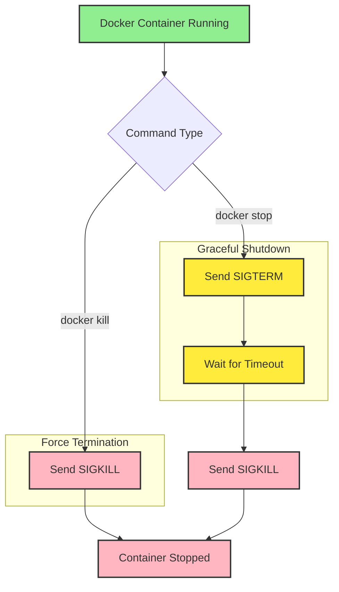

# 🐋 Docker Container Management: Understanding Stop vs Kill Commands
[](https://github.com/TheToriqul/docker-stop-vs-kill)
[](https://github.com/TheToriqul/docker-stop-vs-kill/stargazers)


## 📋 Overview
This project demonstrates my deep dive into Docker container management, specifically focusing on the critical differences between `docker stop` and `docker kill` commands. Through hands-on implementation, I've explored how these commands affect container lifecycle management and application graceful shutdown processes. This knowledge is essential for DevOps engineers and container orchestration specialists working with production environments.

### Core Purpose
An in-depth exploration of Docker container termination mechanisms, demonstrating the crucial differences between graceful shutdown and force termination processes. Provides practical understanding of container lifecycle management, essential for maintaining production-grade containerized applications.

## 🏗 Technical Architecture



## 💻 Technical Stack
- **Frontend:** N/A
- **Backend:**
  - Docker Engine
  - Ubuntu Container Runtime
- **Database:** N/A
- **DevOps:**
  - Shell Scripting
  - Docker CLI
  - Container Orchestration

## ⭐ Key Features
1. Signal Handling Implementation
   - SIGTERM signal processing
   - Graceful shutdown procedures
   - Timeout management

2. Container Management
   - Process monitoring
   - Log analysis
   - State transition handling

3. Cleanup Operations
   - Resource release
   - Process termination verification
   - Container removal

4. Documentation
   - Command reference guide
   - Implementation examples
   - Best practices

## 📚 Learning Journey
### Technical Mastery:
1. Docker container lifecycle management
2. Linux signal handling mechanisms
3. Process management in containerized environments
4. Container logging and monitoring
5. Shell scripting for container automation

### Professional Development:
1. DevOps best practices
2. System administration skills
3. Technical documentation
4. Problem-solving methodology
5. Infrastructure management

## ⚙️ Installation
### Prerequisites
- Docker Engine (version 20.10 or higher)
- Unix-like operating system (Linux/MacOS)
- Basic understanding of shell scripting

### Setup Steps
1. Clone the repository:
```bash
git clone https://github.com/TheToriqul/docker-stop-vs-kill.git
cd docker-stop-vs-kill
```

## 📖 Usage Guide
### Basic Usage
Run the demonstration containers:

```bash
# Start a container with SIGTERM handling
docker run --name graceful-termination -d ubuntu:latest /bin/bash -c "trap 'echo SIGTERM received; exit 0' SIGTERM; while :; do echo 'Running'; sleep 1; done"

# Test docker stop
docker stop graceful-termination

# View the logs
docker logs graceful-termination
```

Experiment with different signal handling scenarios:

```bash
# Start a container with SIGTERM handling as before
docker run --name force-termination -d ubuntu:latest /bin/bash -c "trap 'echo SIGTERM received; exit 0' SIGTERM; while :; do echo 'Running'; sleep 1; done"

# Force kill a container
docker kill force-termination

# View the logs
docker logs force-termination
```

## 📫 Contact
- 📧 Email: toriqul.int@gmail.com
- 📱 Phone: 
  - Singapore: +65 8936 7705
  - Bangladesh: +8801765 939006

## 🔗 Project Links
- [GitHub Repository](https://github.com/TheToriqul/docker-stop-vs-kill)
- [Portfolio](https://github.com/TheToriqul)

## 👏 Acknowledgments
- [Poridhi for excellent labs](https://poridhi.io/)
- [Docker Community for excellent documentation](https://docs.docker.com/)
- Open Source Community for knowledge sharing

Feel free to explore, modify, and build upon this configuration as part of my learning journey. You're also welcome to learn from it, and I wish you the best of luck!